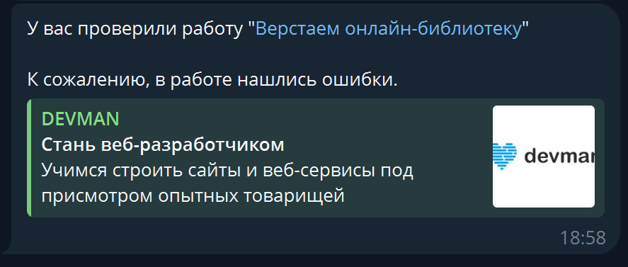

# Task status bot

This telegram bot sends a notification if the assignment is checked by the teacher on [Devman](https://dvmn.org/).

## Installation

- Create your Telegram bot using [BotFather](https://telegram.me/BotFather) and get the bot's API token.
- Get your chat id using [userinfobot](https://t.me/userinfobot).

Create a `.env` file in the project directory. Add your Devman token, Telegram bot token and chat id:
```
TELEGRAM_BOT_TOKEN=tgbot_token
TG_CHAT_ID=your_chat_id
DEVMAN_API_TOKEN=your_devman_token
```

Python3 should already be installed. 
Use `pip` (or `pip3`, if there is a conflict with Python2) to install dependencies:
```
pip install -r requirements.txt
```

## Example usage

Run the script from the command line:
```
python send_notification_bot.py
```
The bot will send a notification if it finds a new checked task:


